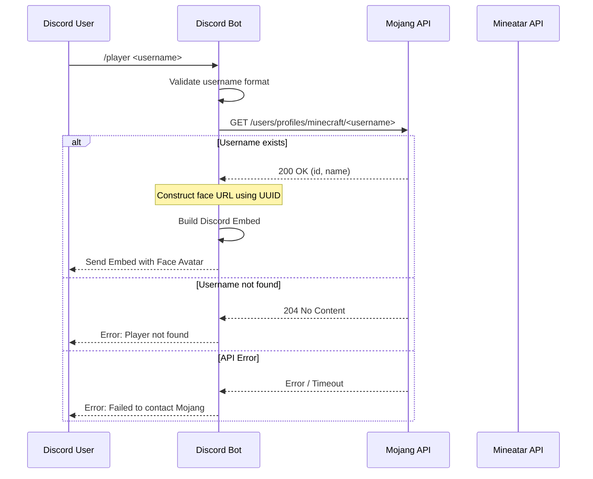

# Future Plans: Player Command Design

This document details the planned design and implementation workflow for the `/player` slash command.

## Overview

The `/player` command will allow users to query information about a Minecraft player by username. The command will fetch the player's unique identifier (UUID) and retrieve their skin's face avatar to present in a Discord embed.

## Technical Specifications

### Command Information
- **Name**: `/player`
- **Description**: "Fetch player information and avatar"
- **Arguments**:
  - `username` (string, required): The Minecraft username to query.

### External API Integrations

#### 1. Mojang Profile API
- **Endpoint**: `https://api.mojang.com/users/profiles/minecraft/{username}`
- **Method**: `GET`
- **Response Format**: JSON
- **Fields of Interest**:
  - `id`: The UUID of the player (without hyphens).
  - `name`: The official case-corrected username.
- **Error Handling**:
  - **404 / 204 No Content**: Username does not exist.
  - **429 Too Many Requests**: Rate limit hit.
  - **5xx / Timeout**: API service unavailable.

#### 2. Mineatar Face API
- **Endpoint**: `https://api.mineatar.io/face/{uuid}`
- **Method**: `GET`
- **Response Format**: Image (PNG)
- **Parameters**: Optional sizes or parameters supported by Mineatar (e.g. scale/size).

## Workflow and Execution Steps



## Proposed Implementation Details

### Discord Embed Structure
- **Title**: Player Profile: `{name}`
- **Thumbnail / Image**: Mineatar Face URL (`https://api.mineatar.io/face/{uuid}`)
- **Fields**:
  - **Official Username**: `{name}`
  - **UUID**: `{uuid}`
  - **Skin Render Link**: Direct URL to view the full skin or raw textures.
- **Footer**: "Data retrieved via Mojang & Mineatar APIs"
- **Color**: Curated Minecraft green or gold theme.

### Example Code Structure (`cogs/player.py`)

```python
import discord
from discord import app_commands
from discord.ext import commands
import aiohttp
from src.logger import logger

class PlayerCog(commands.Cog):
    def __init__(self, bot):
        self.bot = bot

    @app_commands.command(name="player", description="Fetch a Minecraft player profile and head avatar")
    @app_commands.describe(username="Minecraft username to look up")
    async def player(self, interaction: discord.Interaction, username: str):
        await interaction.response.defer(ephemeral=False)
        
        # 1. Resolve Username to UUID via Mojang
        mojang_url = f"https://api.mojang.com/users/profiles/minecraft/{username}"
        async with aiohttp.ClientSession() as session:
            try:
                async with session.get(mojang_url) as resp:
                    if resp.status == 204:
                        await interaction.followup.send(f"❌ Player `{username}` not found.", ephemeral=True)
                        return
                    if resp.status != 200:
                        await interaction.followup.send("❌ Mojang API error. Please try again later.", ephemeral=True)
                        return
                    
                    data = await resp.json()
                    uuid = data["id"]
                    corrected_name = data["name"]
            except Exception as e:
                logger.error(f"Error calling Mojang API: {e}")
                await interaction.followup.send("❌ Failed to contact Mojang API.", ephemeral=True)
                return

        # 2. Construct Mineatar Avatar URL
        avatar_url = f"https://api.mineatar.io/face/{uuid}"

        # 3. Build and Send Discord Embed
        embed = discord.Embed(
            title=f"👤 Player Profile: {corrected_name}",
            color=discord.Color.dark_green(),
            url=f"https://namemc.com/profile/{corrected_name}"
        )
        embed.set_thumbnail(url=avatar_url)
        embed.add_field(name="UUID", value=f"`{uuid}`", inline=False)
        embed.add_field(name="NameMC", value=f"[View Skin/History](https://namemc.com/profile/{corrected_name})", inline=True)
        
        await interaction.followup.send(embed=embed)

async def setup(bot):
    await bot.add_cog(PlayerCog(bot))
```

---

# Future Improvements Roadmap

This section documents planned architecture enhancements, self-healing extensions, and management features discovered during stability and recovery operations.

## 1. Smart Mod Management and Automated Resolution

### Background
When users download mods for incorrect server versions, launch failures can occur (such as `ClassTweakerFormatException` or namespace mismatch between `intermediary` and `official`). While the self-healer now quarantines broken mods to `mc-server/mods/quarantined/`, future iterations should make resolution fully automated.

### Planned Enhancements
- **Automated Compatible Mod Replacement**:
  - When a mod is quarantined during boot failure, the bot queries the Modrinth API for the exact installed game version and loader.
  - If a compatible release exists (e.g. `worldedit-mod-7.4.5.jar` for Minecraft 26.2), prompt the administrator in `#debug` with an interactive button to install the correct build or auto-replace it based on configuration.
- **Dependency and Pre-Install Verification**:
  - Before saving jars in `/mod_search`, query the mod version's `dependencies` array from Modrinth.
  - Automatically detect and download required runtime dependencies (e.g. Fabric API, Architectury, Cloth Config) rather than failing at boot.
- **Discord Mod Manager UI**:
  - Add an interactive Discord select menu in `/mods` allowing administrators to enable, disable (quarantine), or update individual mods directly from Discord without requiring SSH access.

---

## 2. Advanced Self-Healing and Forensics Engine

### Planned Enhancements
- **Dedicated Crash Report Parser**:
  - Expand log forensics beyond `latest.log` to parse `mc-server/crash-reports/crash-*.txt`.
  - Extract root-cause headers, ticking entity coordinates, and specific mod mixin stack traces.
- **Corrupted Chunk Detection and Recovery**:
  - Detect chunk loading and NBT parsing exceptions in server logs.
  - Automatically identify the problematic region coordinates and notify the admin with coordinate data or offer automated backup restoration for that specific dimension.
- **Automated JRE Provisioning**:
  - Enhance `JREManager` to automatically detect Java version mismatches from `UnsupportedClassVersionError` and fetch the required Eclipse Temurin JDK archive dynamically.

---

## 3. Configuration Integrity and State Synchronization

### Planned Enhancements
- **Periodic Two-Way State Reconciliation**:
  - Audit `bot_config.json`, `user_config.json`, and `server.properties` periodically to ensure that manual edits made directly on the host (e.g. changing server port or difficulty via SSH) are automatically reflected in bot memory.
- **Dimension and Seed Extraction**:
  - Enhance seed detection for modded servers with custom world generators or multi-dimension datapacks.
  - Expose spawn coordinates, world size, and gamerules in the `/server_info` command.

---

## 4. Host Health, Telemetry, and Offsite Backups

### Planned Enhancements
- **Raspberry Pi Hardware Telemetry**:
  - For servers running on ARM hardware (Raspberry Pi 5), poll hardware telemetry during status checks:
    - SoC temperature (`vcgencmd measure_temp` or `/sys/class/thermal/thermal_zone0/temp`).
    - Throttling flags (`vcgencmd get_throttled`) to detect undervoltage or thermal throttling.
- **Offsite Backup Replication (Cloud Sync)**:
  - Add automated offsite syncing for daily backups using `rclone` or S3-compatible cloud storage (e.g. Backblaze B2, AWS S3).
  - Protect world data against host hardware failure or accidental host filesystem deletion.

